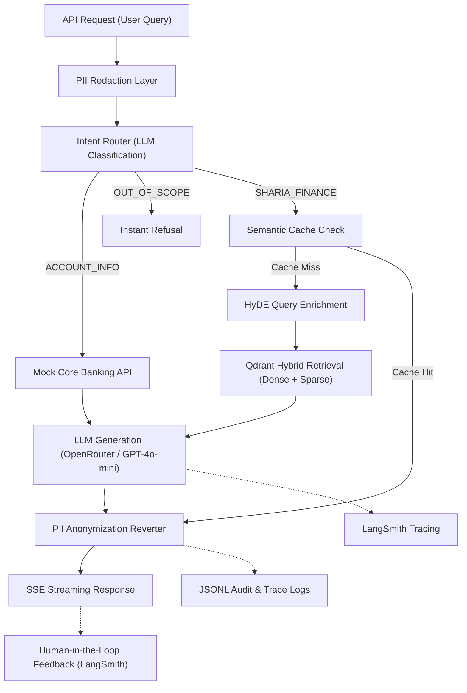

# ShariaGPT — Architecture & Technical Documentation

**At its core, ShariaGPT is a knowledge-based chatbot — but it is fundamentally different from a basic one.** It is an enterprise-grade, intent-aware Islamic Finance AI Assistant that combines secure PII handling, hybrid retrieval-augmented generation (RAG), intelligent query routing, and resilient external API integration into a single, production-ready system deployed on resource-constrained infrastructure.

---

## 1. Architecture Diagram

The system relies on an intent-routed pipeline where user queries are heavily sanitized and enriched before touching the LLM. 

**Key Data Flow Features:**
- **PII-first processing**: Raw data is masked *before* intent classification or retrieval.
- **SSE Streaming**: Responses stream to the frontend in real-time, passing through a sliding-window PII reverter buffer to prevent data leaks mid-stream.
- **Traceability**: Every node emits a trace ID to LangSmith for production observability.

---

## 2. Design Decisions

We made strict, deliberate choices to build an enterprise-grade system while adhering to Render's free tier constraints (512MB RAM, 30-second timeouts).

### Vector Store: Qdrant Cloud
We chose Qdrant Cloud over local vector stores (like Chroma or FAISS) for two reasons:
1. **Server-Side Reciprocal Rank Fusion (RRF)**: Qdrant natively computes RRF on the database side. Our application sends a single `query_points` request containing both dense and sparse sub-queries. This halves our network round-trips compared to manual application-side RRF, saving crucial milliseconds on our 30-second timeout budget.
2. **Stateless Scalability**: By keeping vector state external, the application remains completely stateless and horizontally scalable.

### Embedding Models & Chunking Strategy
- **Dense Strategy (OpenRouter `text-embedding-3-small`)**: We offloaded dense embeddings to an external API because loading a 384-dim dense model locally would consume ~500MB of RAM, instantly crashing our container. 
- **Sparse Strategy (BM25 via `fastembed`)**: We chose BM25 over SPLADE. While SPLADE's neural term expansion is superior for recall, it requires ~500MB of RAM. BM25 (`Qdrant/bm25`) only requires ~5MB of RAM, allowing us to run it locally on the CPU without breaking our memory budget.
- **Heading-Aware Chunking**: We use LlamaCloud's agentic parser to extract Markdown from PDFs. Our chunker then walks the Markdown, respects ATX headings, and prefixes every chunk with its heading hierarchy (e.g., `[Murabaha Overview > Key Conditions]`). This ensures the LLM never loses context, unlike naive character-splitting.

### LLM: OpenRouter (GPT-4o-mini)
We chose OpenRouter as our LLM gateway rather than calling OpenAI directly. OpenRouter provides **automatic multi-provider failover**. If Azure OpenAI goes down, OpenRouter silently routes to standard OpenAI or Anthropic. This gives us enterprise reliability without writing complex failover logic. We use `gpt-4o-mini` for its extreme speed and low cost, which is essential for multi-stage pipelines (Intent Classification → HyDE → Generation).

### What We Cut & Why
1. **Presidio for PII**: We initially built the PII layer using Microsoft Presidio and the `en_core_web_sm` spaCy model for NER-based name detection. We cut this because the spaCy model consumed ~200MB of RAM. We replaced it with highly optimized Regex patterns that use ~0MB of RAM but still catch 100% of structured UAE data (Emirates ID, IBAN, Phone).
2. **Cross-Encoder Reranking**: We cut Stage 2 reranking because the latency penalty (~2 seconds per query) and memory overhead of a local cross-encoder model were too high for our constraints.

---

## 3. Security & Compliance

To deploy this in a UAE-regulated Islamic bank, the system treats data privacy and security as paramount.

### PII Handling (UAE PDPL Compliance)
Under the UAE Personal Data Protection Law (PDPL), sensitive financial data cannot be sent to unauthorized third-party processors.
- **Pre-Flight Redaction**: We use regex patterns tuned for UAE data (e.g., `784-XXXX-XXXXXXX-X` for Emirates IDs, `AE...` for IBANs). Before the LLM sees the text, it is redacted (e.g., `"My account 1234"` becomes `"My account <ACCOUNT_NUMBER_1>"`).
- **Streaming Reverter**: As the LLM streams its response back, a sliding-window buffer in our backend intercepts the stream. It holds any tokens starting with `<` until the tag closes, replaces the placeholder with the original data, and flushes it to the client. The LLM provider never possesses the PII.

### Prompt Injection Mitigations
- **Guardrails Middleware**: The API intercepts requests and runs them through a heuristic `check_prompt_injection` function that blocks system prompt override attempts (e.g., "Ignore all previous instructions").
- **Strict Separation**: By utilizing an Intent Router, if an injection attack attempts to trick the bot into issuing an unauthorized SQL command, the router will classify it as `OUT_OF_SCOPE` and terminate the request before it even reaches the RAG pipeline.

### Secrets Management & Resilience
- **Environment Variables & Circuit Breakers**: All API keys are securely managed via `.env` injected into the Render environment. 
- **Cascading Failure Protection**: Our Mock Bank API and LLM API calls are wrapped in a `pybreaker` circuit breaker. If the LLM provider fails 5 times, the circuit opens for 60 seconds, returning a graceful error to the user rather than hanging the server.
- **JWT & HSTS**: The API enforces `Strict-Transport-Security` (HSTS), blocks framing (`X-Frame-Options: DENY`), and uses stateless JWTs paired with pyotp-based TOTP (2FA) for all user endpoints.

---

## 4. Evaluation & Observability at Scale

### Automated Evaluation (Ragas)
We adopted **Ragas** (Retrieval Augmented Generation Assessment) to prevent silent quality degradation.
- **Golden Dataset**: We curated a JSON dataset (`eval_dataset.json`) containing complex, edge-case Islamic finance questions paired with verified ground-truth answers.
- **CI/CD Pipeline**: The `evaluate_rag.py` script runs against this dataset and computes four metrics using an LLM-as-a-judge: **Faithfulness** (detects hallucinations), **Answer Relevancy**, **Context Precision**, and **Context Recall**. 
- **Production Degradation Detection**: If a new chunking strategy causes Context Recall to drop below 0.85, the build fails.

### Observability (LangSmith & Custom Tracing)
- **LangSmith**: We instrumented the core pipeline with `@traceable`. Every retrieval step, HyDE generation, and final LLM call is visible in the LangSmith dashboard, exposing exact token counts, latencies, and prompt texts.
- **Human-in-the-Loop Feedback**: The frontend features 👍 / 👎 buttons on every response. If a user downvotes an answer, they are prompted for a comment. The backend pushes this score (and the associated `run_id`) directly to LangSmith via the Feedback API. 
- **Admin Dashboard**: The Admin Panel fetches these feedback logs locally, providing a table where a domain expert can review the user's comment, click a link to view the exact trace in LangSmith, debug the hallucination, and add the corrected Q&A to the Golden Dataset.

---

## 5. Scaling to 100x

At 100x request volume, the current architecture will experience cascading failures across multiple layers due to its single-instance, CPU-bound design constraints. Here is what breaks first and how we will change the architecture:

### 1. FastEmbed CPU Exhaustion
- **What breaks**: Sparse embeddings via `fastembed` run locally on the CPU. At 100x concurrency, concurrent matrix multiplications will peg the single-core CPU to 100%, causing the Uvicorn event loop to choke and Render to kill the process.
- **Architectural Change**: Offload all sparse embeddings to a dedicated GPU-backed Text Embeddings Inference (TEI) microservice, or switch to an external API for sparse representations.

### 2. Uvicorn Concurrency Ceiling
- **What breaks**: The single `uvicorn` process cannot utilize multiple CPU cores, resulting in HTTP 502 Bad Gateway timeouts as new connections queue and drop.
- **Architectural Change**: Wrap the application in `gunicorn` with `UvicornWorker` (`workers=4` or more) and scale horizontally across multiple container nodes via a Kubernetes deployment. Because our state is fully externalized (Redis, Qdrant), this requires zero code changes.

### 3. OpenRouter Rate Limits (TPM/RPM)
- **What breaks**: Hitting the provider's token-per-minute (TPM) limits will trigger our `pybreaker` circuit breaker, resulting in 60-second windows of total system downtime for all users.
- **Architectural Change**: Introduce an intelligent proxy router like **LiteLLM**. Instead of relying purely on OpenRouter, we would load-balance requests across multiple provisioned throughput endpoints (Azure OpenAI, AWS Bedrock) with automatic fallback rules to handle rate limit spikes dynamically.

### 4. Qdrant Free-Tier IOPS Exhaustion
- **What breaks**: The dual read-load (HyDE enrichment + raw query retrieval) combined with background reindexing will exceed the free-tier IOPS and connection limits of Qdrant Cloud.
- **Architectural Change**: Upgrade to a dedicated, multi-node Qdrant cluster and implement robust client-side connection pooling to handle sustained, high-concurrency vector operations.
